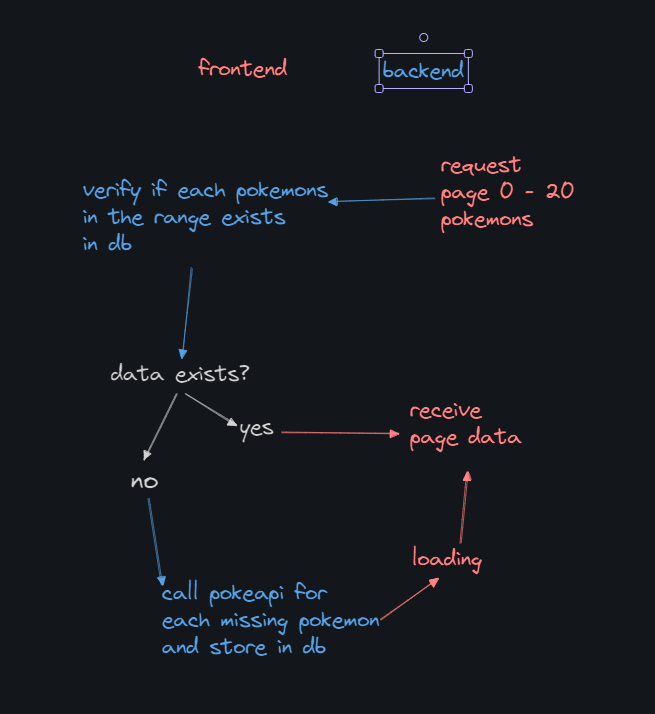
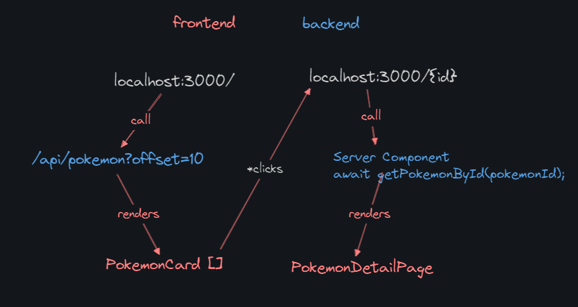

## Getting Started

1. `npm install`
2. `npx prisma db push`
(for any error you can delete `/prisma/dev.db`, `touch dev.db` on `/prisma` and re-run `npx prisma db push`)

run the development server:

```bash
npm run dev
# or
yarn dev
# or
pnpm dev
# or
bun dev
```
## Requirements
- Nodejs 18.2 +

# Pokémon Data Storage and Retrieval Documentation

This documentation explains how Pokémon data is stored and handled in both the backend and frontend of a Next.js application. 

It covers the data flow from fetching Pokémon information from an external API to displaying it on the frontend, including details about database interactions, state management, and component structure.

## Key Takeaways:
- ### Backend:
    - Data is fetched from the PokeAPI and stored in a SQLite database via Prisma.
    - API route /api/pokemon prevent redundant extern API calls
    - API routes provide pokemon id for fetching Pokémon data with pagination.
    - Caching improves performance by reducing redundant API calls.

- ### Frontend:
    - State management is handled using actions, reducer, context, and custom hooks.
    - Components are structured to display lists and details of Pokémon.
    - Pokemon detail data is cached and retrieved from DB, 
    preventing redudant external API calls from the client.
    - Pagination is implemented using next and previous offset the pokemon context.

---

## Poplin Test Preview Video

https://github.com/user-attachments/assets/62c8e51b-755f-4d55-986f-a4f2b5c46f79

## Table of Contents

- [Pokémon Data Storage and Retrieval Documentation](#pokémon-data-storage-and-retrieval-documentation)
  - [Key Takeaways:](#key-takeaways)
  - [Poplin Test Preview Video](#poplin-test-preview-video)
  - [Table of Contents](#table-of-contents)
  - [Overview](#overview)
  - [Backend Implementation](#backend-implementation)
    - [Database Schema](#database-schema)
    - [Fetching and Storing Pokémon Data](#fetching-and-storing-pokémon-data)
    - [API Routes](#api-routes)
  - [Frontend Implementation](#frontend-implementation)
    - [Routes and Render behavior](#routes-and-render-behavior)
    - [Pagination](#pagination)
    - [State Management](#state-management)
      - [Actions](#actions)
      - [Reducer](#reducer)
      - [Hooks](#hooks)
      - [Context and Provider](#context-and-provider)
---

## Overview

Poplin Technical test is a Pokemon catalog built with Next.js, using the App Router and TypeScript. It fetches data from the [PokeAPI](https://pokeapi.co/) and stores it in a SQLite database via Prisma ORM. The frontend displays a list of Pokémon with pagination and allows users to view details of individual Pokémon.

---

## Backend Implementation

### Database Schema

We use Prisma ORM with SQLite as our database. The schema is defined to store Pokémon data efficiently.

```prisma
// prisma/schema.prisma

generator client {
  provider = "prisma-client-js"
}

datasource db {
  provider = "sqlite"
  url      = env("DATABASE_URL")
}

model Pokemon {
  id      String   @id @default(cuid())
  pokemonId Int    @unique
  data      String
}

```

- id: Auto-generated CUID primary key.
- pokemonId: The unique identifier of the Pokémon from the PokeAPI.
- data: A JSON string containing the entire Pokémon data fetched from the PokeAPI.
---


### Fetching and Storing Pokémon Data

in order for the backend to prevent frontend of redudant API calls of the pokemon
heavy data, we store all pokemons (range between offset - offset+limit) requested by the main page in the database before showing
them to the user.

- Checks if the Pokémon data exists in the database.
- If not, fetches the data from the PokeAPI.
- Stores the fetched data in the database.
- Returns the Pokémon data.



this is the function the executes new db creations
``` 
export async function fetchAndStorePokemons(pokemonsToFetch: number[]) {
    const fetchedPokemons = [];
    for (const id of pokemonsToFetch) {
        try {
            await new Promise(resolve => setTimeout(resolve, 200));

            const pokemonResponse = await axios.get(`https://pokeapi.co/api/v2/pokemon/${id}`);
            const pokemonData = pokemonResponse.data;

            await prisma.pokemon.create({
                data: {
                    pokemonId: pokemonData.id,
                    data: JSON.stringify(pokemonData),
                },
            });

            fetchedPokemons.push({
                id: pokemonData.id,
                name: pokemonData.name,
                image: pokemonData.sprites.front_default,
            });
        } catch (error) {
            console.error(`Error fetching data for Pokémon ID ${id}:`, error);
        }
    }

    return fetchedPokemons;
}
```

---

### API Routes

- ```src/app/api/pokemon```
    - is a backend route called by the frontend for requesting pokemons page, stores the pokemons in db and retrieve page data
- ```src/app/api/{pokemon}```
    - uses fetchAndStorePokemons for creating new db entries, called by the client side
---

## Frontend Implementation

### Routes and Render behavior

Frontend in the main page initially calls `/api/pokemon?offset=10` and gets the data of the
pokemon listing with loading, renders it 



### Pagination

In the `usePokemon()` hooks there is a side-effect waiting for new page changes

```
    useEffect(() => {
        fetchPokemonPage(state.offset);
        // eslint-disable-next-line react-hooks/exhaustive-deps
    }, [state.offset]);

```

that automatically calls `fetchPokemonPage` on the state.offset change.

Buttons are properly disabled or enabled in conformity of offset and limit values

```
    <button
        onClick={handlePrevious}
        disabled={state.offset === 0}
        className={`px-4 py-2 rounded bg-blue-500 text-white ${
        state.offset === 0 ? 'opacity-50 cursor-not-allowed' : ''}`}
    >
        Previous
    </button>

    <button
        onClick={handleNext}
        disabled={state.offset + 10 >= 1310}
        className={`px-4 py-2 rounded bg-blue-500 text-white ${
           (state.offset + 10 >= 1310) ? 'opacity-50 cursor-not-allowed' : ''}`}
    >
        Next
    </button>

```

### State Management

State management in client side uses Flux Architecture (global state with actions), 
with a combination of React Hooks such as useContext and useReducer. 

#### Actions

actions are descriptions of what it needs (as payloads and action names) to be called successfuly

```
import { ApiPokemonResponseType } from "@/app/api/pokemon/types";

export const FETCH_POKEMON_PAGE_REQUEST = 'FETCH_POKEMON_PAGE_REQUEST';
export const FETCH_POKEMON_SUCCESS = 'FETCH_POKEMON_SUCCESS';
export const FETCH_POKEMON_FAILURE = 'FETCH_POKEMON_FAILURE';
export const SET_OFFSET = 'SET_OFFSET';

// Define action types
export type PokemonAction =
    | { type: 'FETCH_POKEMON_PAGE_REQUEST' }
    | { type: 'FETCH_POKEMON_PAGE_SUCCESS'; payload: ApiPokemonResponseType }
    | { type: 'FETCH_POKEMON_PAGE_FAILURE'; error: string }
    | { type: 'SET_OFFSET'; offset: number }

```

#### Reducer

the reducer receives data payload from actions (called from the hooks)
and stores it in the state context, while keeping updated about loading states

```
import { ApiPokemonResponseType } from '@/app/api/pokemon/types';
import { PokemonAction } from './actions';

export interface PokemonState {
    page: ApiPokemonResponseType | null;
    loading: boolean;
    error: string | null;
    offset: number;
}

export const initialState: PokemonState = {
    page: null,
    loading: false,
    error: null,
    offset: 0,
};

export function pokemonReducer(state: PokemonState, action: PokemonAction): PokemonState {
    switch (action.type) {
        case 'FETCH_POKEMON_PAGE_REQUEST':
            return { ...state, loading: true, error: null };
        case 'FETCH_POKEMON_PAGE_SUCCESS':
            return { ...state, loading: false, page: action.payload };
        case 'FETCH_POKEMON_PAGE_FAILURE':
            return { ...state, loading: false, error: action.error };
        case 'SET_OFFSET':
            return { ...state, offset: action.offset };
        default:
            return state;
    }
}
```

#### Hooks

hooks are the gateway for the async call isolation from the component body, and they serve as 
bridge to define the behavior of change pages 

```
'use client'
import { useContext, useEffect } from 'react';
import { PokemonContext } from '@/context/pokemon/index';

export function usePokemon() {
    const context = useContext(PokemonContext);
    if (!context) {
        throw new Error('usePokemon must be used within a PokemonProvider');
    }

    const { state, dispatch } = context;

    const fetchPokemonPage = async (offset: number) => {
        dispatch({ type: 'FETCH_POKEMON_PAGE_REQUEST' });
        try {
            const response = await fetch(`/api/pokemon?offset=${offset}`);
            if (!response.ok) {
                throw new Error('Failed to fetch Pokémon data.');
            }
            const data = await response.json();
            dispatch({ type: 'FETCH_POKEMON_PAGE_SUCCESS', payload: data });
        } catch (err) {
            console.error(err);
            dispatch({ type: 'FETCH_POKEMON_PAGE_FAILURE', error: 'Failed to load Pokémon data.' });
        }
    };

    const setOffset = (offset: number) => {
        dispatch({ type: 'SET_OFFSET', offset });
    };

    useEffect(() => {
        fetchPokemonPage(state.offset);
        // eslint-disable-next-line react-hooks/exhaustive-deps
    }, [state.offset]);


    return { state, setOffset };
}
```

#### Context and Provider

Context and Providers are the Global State and action provider for the components below the 
hierachical tree in ReactJS client side 

```
'use client';

import React, { createContext, useReducer, Dispatch } from 'react';
import { pokemonReducer, initialState, PokemonState } from './reducer';
import { PokemonAction } from './actions';

interface PokemonContextProps {
  state: PokemonState;
  dispatch: Dispatch<PokemonAction>;
}

export const PokemonContext = createContext<PokemonContextProps | undefined>(undefined);

export const PokemonProvider: React.FC<{ children: React.ReactNode }> = ({ children }) => {
  const [state, dispatch] = useReducer(pokemonReducer, initialState);

  return (
    <PokemonContext.Provider value={{ state, dispatch }}>
      {children}
    </PokemonContext.Provider>
  );
};
```
they are implemented in the RootLayout of the application

```
export default function RootLayout({
  children,
}: Readonly<{
  children: React.ReactNode;
}>) {
  return (
    <html lang="en">
      <body
        className={`${geistSans.variable} ${geistMono.variable} antialiased`}
      >
        <PokemonProvider>
          {children}
        </PokemonProvider>
      </body>
    </html>
  );
}
```
